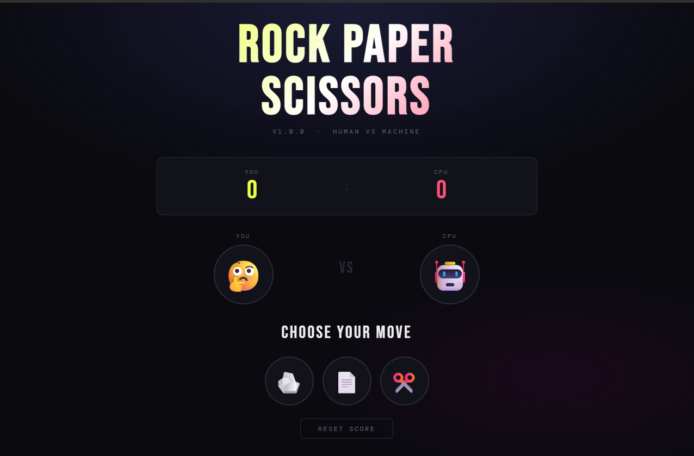
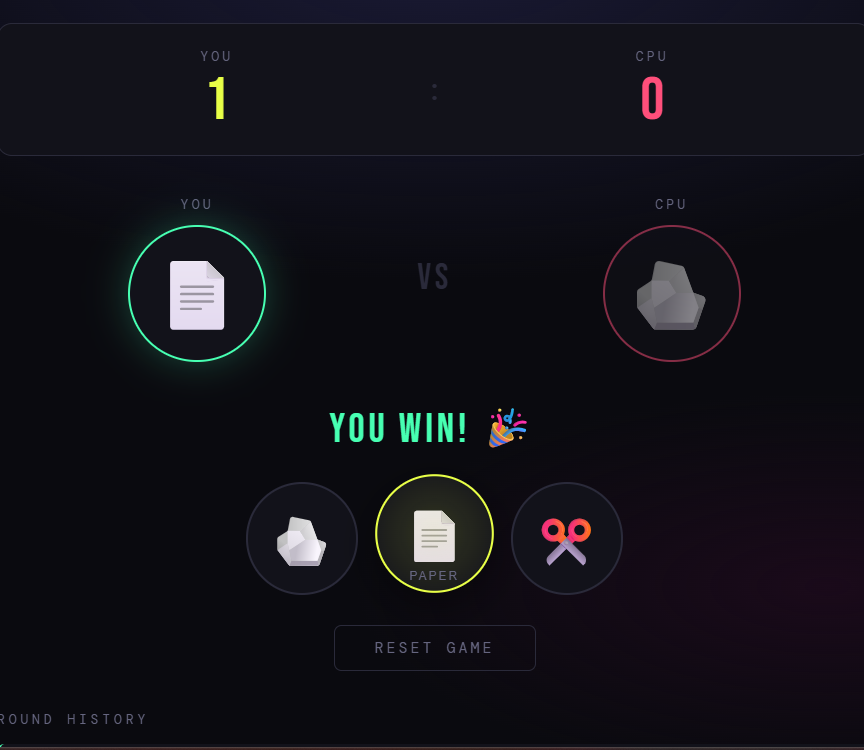
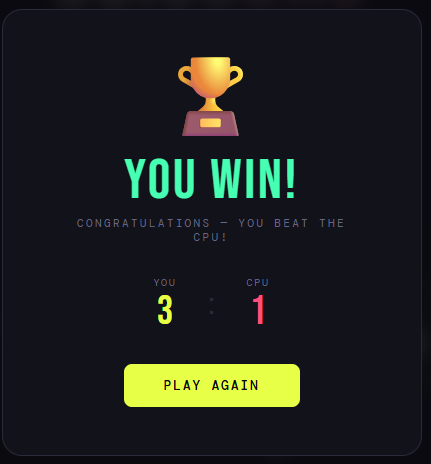

# Rock Paper Scissors — Best of 5

A browser-based **Rock Paper Scissors** game built with vanilla HTML, CSS, and JavaScript. Players compete against a CPU opponent over 5 rounds; after the final round a winner is announced. No frameworks or external libraries are required, the game runs entirely in any modern web browser.

---

## Project Description

This project is a fully interactive Rock Paper Scissors game where the user plays against a computer opponent. The CPU selects its move randomly each round. After 5 rounds, the game calculates the final score and displays a winner announcement overlay. The project demonstrates core web development concepts including DOM manipulation, event handling, CSS animations, and game state management all without any build tools or dependencies.

**Core features:**
- Best-of-5 format with round progress indicators (pips)
- Animated choice reveals with a CPU "thinking" delay
- Win / Lose / Draw feedback with colour-coded visuals
- Live scoreboard that updates each round
- Game Over overlay announcing the winner after round 5
- Full round history log
- Reset / Play Again to start a new game

---

## How to Run the Project

### Option 1, Open directly in a browser (recommended, no setup needed)

```bash
# 1. Clone the repository
git clone https://github.com/YOUR_USERNAME/rock-paper-scissors.git

# 2. Navigate into the project folder
cd rock-paper-scissors

# 3. Open index.html in your default browser
open index.html        # macOS
start index.html       # Windows
xdg-open index.html    # Linux
```

Alternatively, double-click `index.html` in your file explorer, it will open directly in your browser.

### Option 2, Serve locally with Python (optional)

```bash
python3 -m http.server 8000
# Then visit: http://localhost:8000
```

### Option 3, Serve locally with Node.js (optional)

```bash
npx serve .
# Visit the URL printed in the terminal
```

---

## Dependencies and Prerequisites

| Requirement | Details |
|-------------|---------|
| Web browser | Any modern browser Chrome, Firefox, Edge, or Safari |
| Internet connection | Only required to load Google Fonts on first load |
| Node.js or Python | **Optional**, only needed if running a local server (Options 2 & 3 above) |

> **Offline use:** The game works fully offline. If there is no internet connection, Google Fonts will not load and the browser will fall back to system monospace fonts automatically. Gameplay is unaffected.

There are **no npm packages, no build steps, and no installation required.** The entire project is a single HTML file.

---

## Project Structure

```
rock-paper-scissors/
├── index.html          # Complete game — HTML, CSS, and JavaScript in one file
├── README.md           # Project documentation (this file)
├── .gitignore          # Ignores OS and editor files
└── screenshots/
    └── gameplay.png    # Screenshot of the game running with visible timestamp
```

---

## Screenshots

### Gameplay in action
 



---

## How to Play

1. Open `index.html` in your browser
2. Click **Rock 🪨**, **Paper 📄**, or **Scissors ✂️** to make your move
3. The CPU will reveal its choice after a short delay
4. The scoreboard and round history update after each round
5. After **5 rounds**, a Game Over screen announces the overall winner
6. Click **Play Again** to start a new game

**Rules:**
- Rock beats Scissors
- Paper beats Rock
- Scissors beats Paper
- Same choice = Draw

---

## Technologies Used

- **HTML5** — page structure and semantic markup
- **CSS3** — layout, animations, and CSS custom properties (variables)
- **Vanilla JavaScript** — game logic, DOM manipulation, and `setTimeout`-based timing
- **Google Fonts** — Bebas Neue (display headings) and DM Mono (body text)
